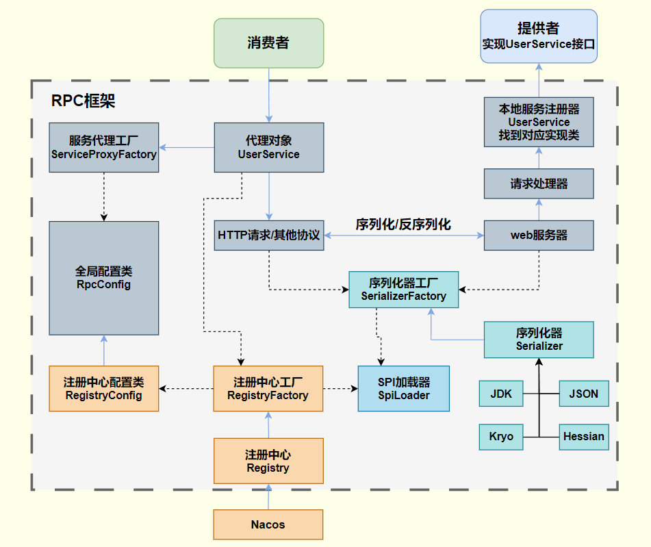

# Yuqi-RPC


## 项目概述
本项目是一款基于 Netty 实现的 RPC 框架，支持多种序列化方式（Hessian、JDK、Jackson、Kryo），使用 Nacos 作为注册中心。
开发者可以引入Spring Boot Starter，并通过注解和配置文件来快速使用框架。本框架还实现了 SPI 机制，支持动态扩展序列化器。

## 架构图


## 特性
- 基于 Netty + HTTP 协议实现了消息的网络传输
- 使用 Nacos 作为服务注册中心，管理服务提供者信息
- 实现了 SPI 机制，可以很方便地扩展功能
- 内置多种序列化器，用户可以通过配置进行选择

## 快速使用
### 公共模块
导入Starter并定义接口：
```xml
<dependency>
    <groupId>com.lyq</groupId>
    <artifactId>rpc-springboot-starter</artifactId>
    <version>0.0.1-SNAPSHOT</version>
</dependency>
```
```java
public interface UserService {
    User getUser(User user);
}
```

### 提供者
在项目启动类加上`@EnableRpc`注解，以启用RPC框架。
```java
@SpringBootApplication
@EnableRpc
public class SpringBootProviderExample {
    public static void main(String[] args) {
        SpringApplication.run(SpringBootProviderExample.class, args);
    }
}
```
服务提供者实现定义的接口,并使用`@RpcService`声明服务：
```java
@Service
@RpcService
public class UserServiceImpl implements UserService {
    public User getUser(User user) {
        System.out.println("用户名：" + user.getName());
        return user;
    }
}
```

### 消费者
消费者同样需要先开启RPC功能。
```java
@SpringBootApplication
@EnableRpc
public class SpringBootConsumerExample {
    public static void main(String[] args) {
        SpringApplication.run(SpringBootConsumerExample.class, args);
    }
}
```
然后通过注解引入服务：
```java
@Service
public class ServiceImpl {
    @RpcReference
    private UserService userService;

    public void test() {
        User user = new User();
        user.setName("liyuqi123");
        User serviceUser = userService.getUser(user);
        System.out.println(serviceUser.getName());
    }
}
```

### 配置文件
消费者和提供者都需要添加配置文件。
示例：
```properties
rpc.name=bestRpc
rpc.version=2.0
rpc.serverHost=127.0.0.1
rpc.serverPort=8081
rpc.serializer=hessian
rpc.registryConfig.registry=nacos
rpc.registryConfig.address=http://192.168.xx.xx:8848
```